# codeCV with AI

**AI-powered Resume Builder SaaS Platform**

---

## 🧠 Problem Statement

Traditional resume building is time-consuming and frustrating. Job seekers struggle to:
- Create visually appealing and tailored resumes.
- Generate unique, compelling content for every application.

**codeCV with AI** aims to solve this by automating resume content generation using AI, providing an intuitive UI, and offering customizable templates to streamline the process.

---

## 💡 Solution

We developed a **SaaS web application** leveraging modern web technologies and AI to:
- Automatically generate personalized resume content.
- Offer user-friendly forms and resume templates.
- Simplify resume creation, editing, sharing, and downloading.

---

## 🌐 What is SaaS?

**SaaS (Software as a Service)** delivers software over the internet—no installations needed. Users access the platform via their browsers. Examples: Gmail, Dropbox, Google Docs.

---

## 🧱 Technical Overview

### 🏗️ System Architecture

The project follows a **client-server architecture** with three main layers:

1. **Frontend** – ReactJS + Vite
2. **Backend** – Strapi CMS + Clerk Auth
3. **Database** – MySQL

### ⚙️ Frontend (Port: 5173)

Built with **ReactJS** and **Vite** for a fast, modern development experience.

#### Features:
- Homepage (Intro + CTA)
- Sign-in/Sign-up with Google, GitHub, or Email
- Dashboard (Manage & Create Resumes)
- Edit Resume (Forms + Resume Content)
- View & Download Resume (PDF & Share options)

#### Why React?
- Component-based architecture
- Virtual DOM for performance
- Community support and flexibility

#### Why Vite?
- Lightning-fast hot reload (HMR)
- Native ES Module support
- Better dev experience with optimized builds

---

### 🛠️ Backend (Port: 3306)

Uses **Strapi CMS** for content management and API creation, and **Clerk** for authentication.

#### Features:
- Resume CRUD operations
- Auth via Clerk (Signup/Login)
- Gemini API integration for AI content generation

#### Why Strapi?
- Auto-generates RESTful APIs
- Customizable content types
- Built-in admin panel

#### Why Clerk?
- Easy and secure user auth
- Email + Social login support
- Backend-as-a-Service (BaaS)

---

### 🗃️ Database – MySQL (Relational)

Stores structured resume data like:
- Personal info
- Education
- Experience
- Skills

#### Why SQL?
- Structured schema
- Powerful querying
- Data integrity and scalability

---

## 🔗 API Design

| Endpoint | Method | Description |
|----------|--------|-------------|
| `/user-resumes` | POST | Create new resume |
| `/user-resumes?filters[userEmail][$eq]={userEmail}` | GET | Get resumes by email |
| `/user-resumes/:id` | GET | Get resume by ID |
| `/user-resumes/:id` | DELETE | Delete resume by ID |

---

## 🚀 Deployment

- **Frontend** hosted on [Vercel](https://vercel.com/)
- **Backend** deployed on [Render](https://render.com/)

---

## 🖼️ Screenshots

> 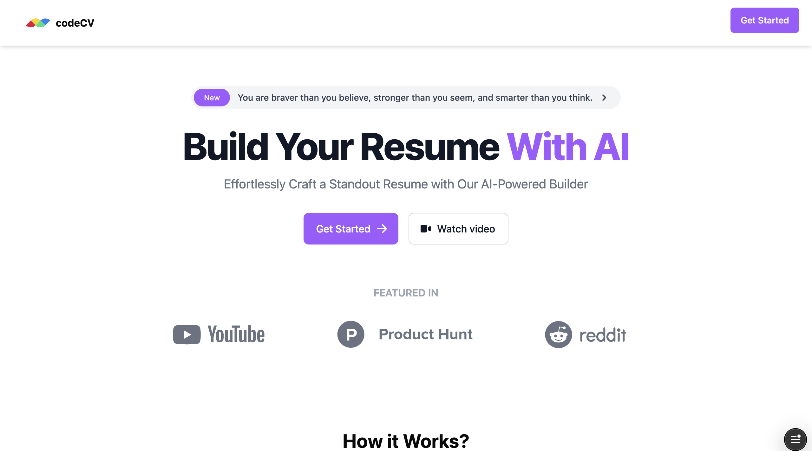
> 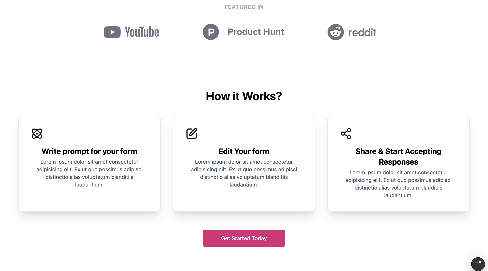
> 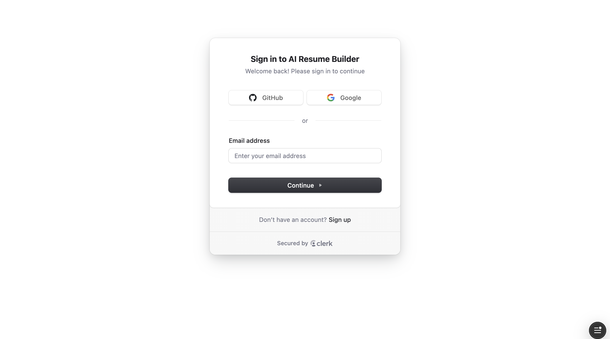
> 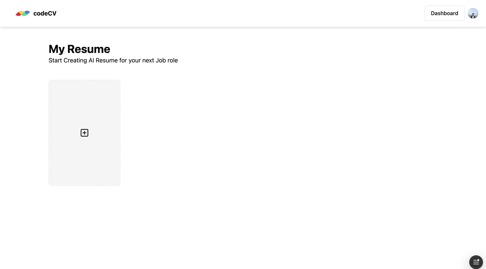
> 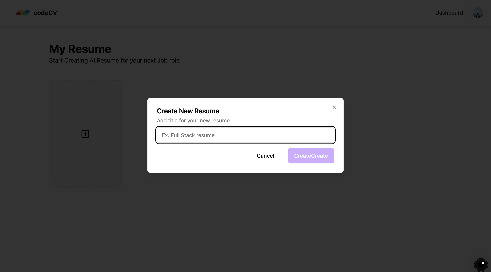
> 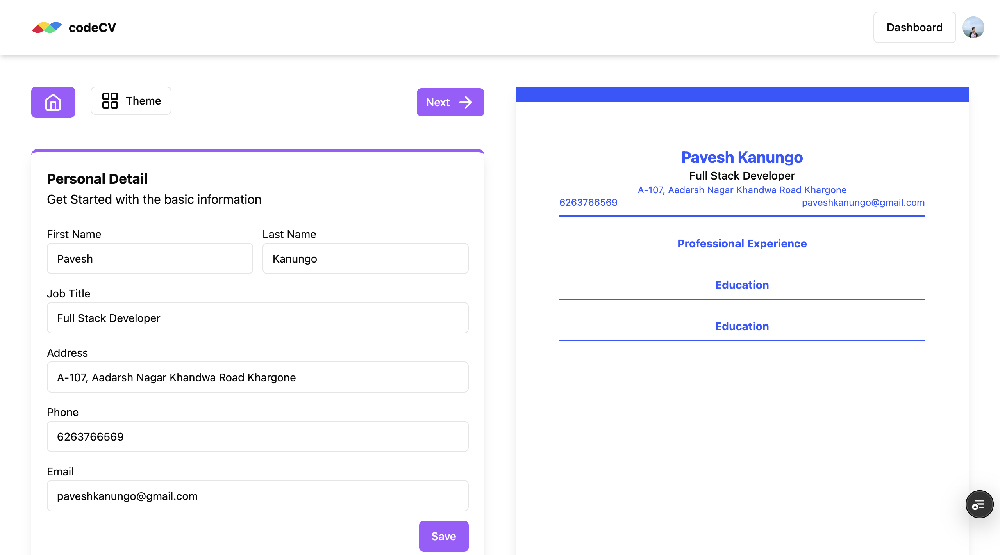
> 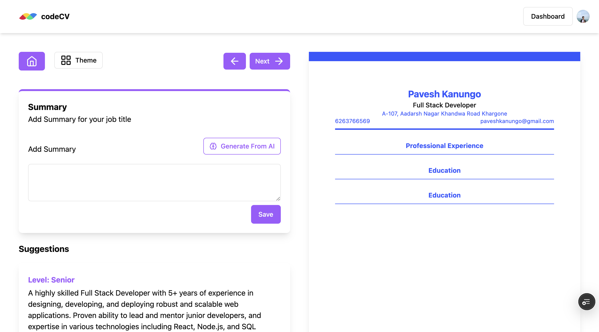
> 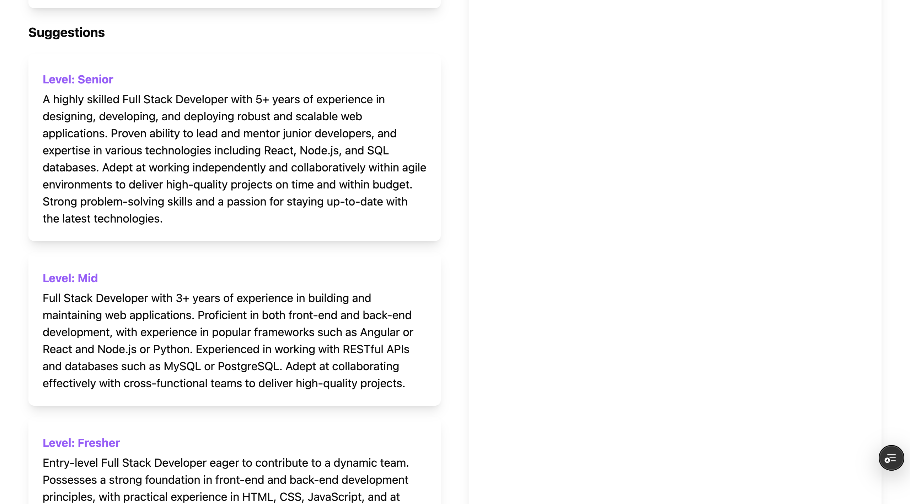
> 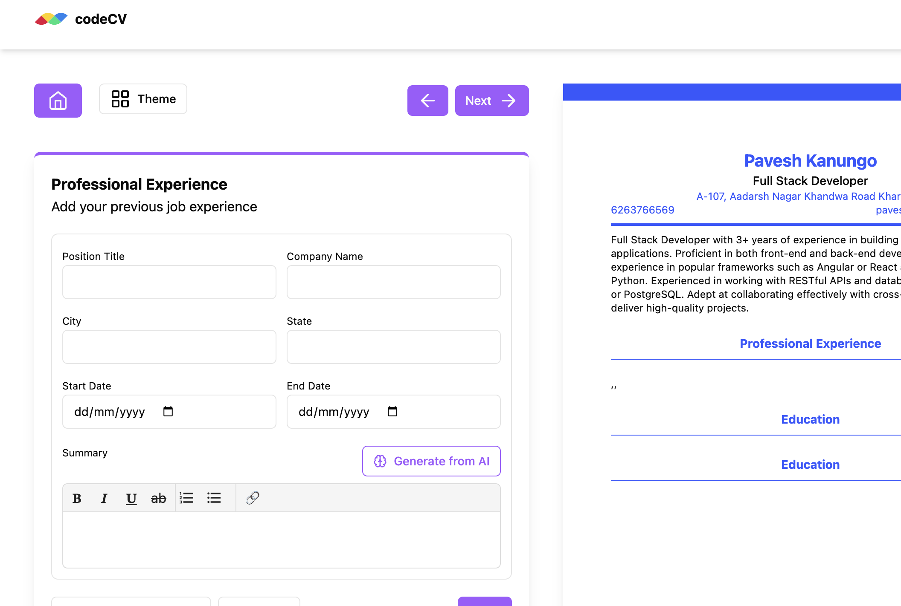
> 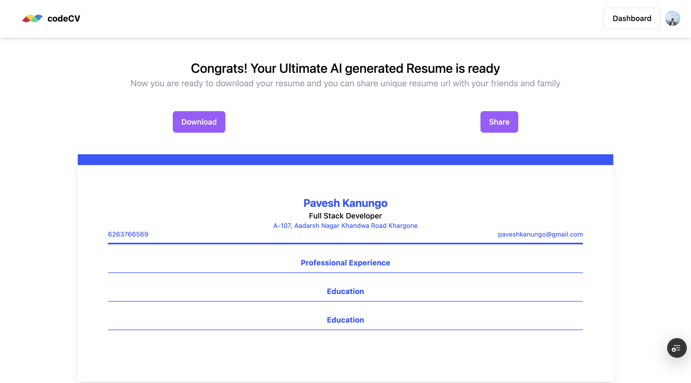
> 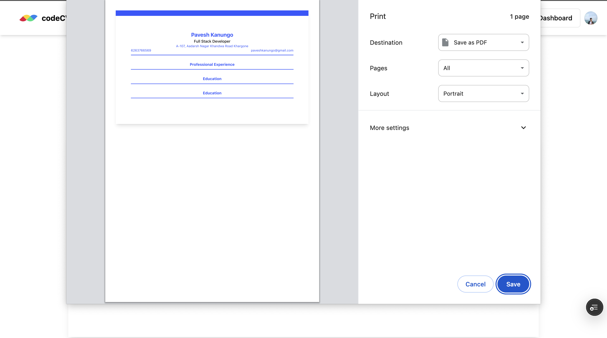 

---

## 👨🏻‍💻 Run Locally
```bash
# Clone the project
git clone https://github.com/paveshkanungo/codeCV-with-AI.git

# Keep this directory inside another directory(main directory) and install frontend dependencies and name the directory as "ai-resume-builder"
cd ai-resume-builder
npm install

# This is the frontend part of codeCV-with-AI, backend part is in another repository

```

---

## 🔐 Environment Variables

To run this project locally, you need to set up environment variables:

### 📁 Root `.env.local` file

```env.local
VITE_CLERK_PUBLISHABLE_KEY =
VITE_STRAPI_API_KEY = 
VITE_GOOGLE_AI_API_KEY =
VITE_BASE_URL =
```

---

## Go to Backend repository
Visit [codeCV-with-AI-admin](https://github.com/paveshkanungo/codeCV-with-AI-admin#)